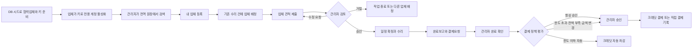

# 업체관리·협력업체 작업·크레딧 결제 설계

- 상태: 승인된 설계
- 작성일: 2026-07-14
- 기준 브랜치: `origin/dev` (`501a49b0`)
- 구현 난이도: `xhigh`
- 예상 변경 범위: 핵심 약 30~40개, 공개 검색·외부 연락 연동까지 포함 시 약 35~50개 파일

## 1. 결정 요약

이번 작업의 중심은 다음 세 축이다.

1. 운영측이 DB에 준비한 협력업체를 관리자가 검색해 자기 업체로 등록하는 업체관리
2. 등록 키로 업체 전용 계정을 활성화하고 기존 업체 작업 화면에서 견적·일정·완료·결제요청을 처리하는 흐름
3. 관리자가 Toss 테스트 결제로 크레딧을 충전하고 정책에 따라 승인 또는 자동 차감하는 결제 시스템

AI의 하자 책임 판단, 자연어 요약, 음성 기능과 책임 경로 전체 구현은 이 작업에 포함하지 않는다. 다른 AI 에이전트가 만든 결과를 업체 검색·배정·결제 흐름에서 사용할 수 있도록 최소 계약만 제공한다.

관리자 업체관리 내부 탭은 다음으로 고정한다.

```text
내 업체 | 업체 찾기 | 크레딧·결제
```

데스크톱 `ManagerAppShell`을 사용하는 모든 관리자 화면 우상단에는 다음 전역 크레딧 도구를 노출한다.

```text
크레딧 480,000원  [ 충전 ]
```

- 잔액 선택: `업체관리 > 크레딧·결제`로 이동
- `충전` 선택: 현재 화면 위에 인앱 충전 모달 표시
- 충전 성공: 원래 화면을 유지하고 우상단 잔액 갱신
- 브라우저 새 창 팝업과 좌측 사이드바 잔액 위젯은 사용하지 않음

## 2. 목표

- 관리자가 운영측 전역 업체 원장에서 업체를 검색하고 `내 업체`로 등록·해제할 수 있다.
- 관리자 직접 업체 생성과 가짜 `manual:<vendorId>` 계정 생성을 제거한다.
- 업체는 일회성 등록 키로 전용 계정을 활성화한다.
- 기존 `/vendor/job/00~06` 화면을 실제 작업 상태와 API에 연결한다.
- 협력업체가 구조화된 견적을 제출하고 관리자에게 승인·수정 요청·거절 결과를 받는다.
- 승인된 견적을 결제 기준 금액으로 고정한다.
- 관리자는 Toss 테스트 결제로 서비스 크레딧을 충전한다.
- 관리자는 `모든 결제 승인` 또는 `한도 이하 자동결제` 정책을 선택한다.
- 자동결제는 승인 견적과 결제요청 금액이 같고, 수리 완료·잔액·한도 조건을 모두 충족할 때만 실행된다.
- 재시도와 중복 클릭으로 업체 계정·견적·결제·원장이 중복 생성되지 않는다.
- 다른 세입자·AI 작업이 사용할 수 있는 공개 업체 검색과 외부 업체 연락 시도 계약을 제공한다.

## 3. 비목표

다음은 이번 구현에서 제외한다.

- AI 모델, 프롬프트, 음성, 책임 판단, 자연어 요약 생성
- 책임 판단에 따른 세입자·관리자 전체 화면 분기
- 관리자 AI 알림 문구 생성
- 실제 지도·지역검색 API
- 운영자 콘솔과 운영자 역할 추가
- 관리자에 의한 전역 업체 원장 생성·편집
- 여러 업체 경쟁견적과 입찰 현황 공개
- 업체 직원 다중 계정 UI
- 견적 항목 부분 승인
- 부분 지급과 분할 결제
- 실제 업체 계좌 송금·출금·환전·정산
- 실사용 PG 법무 검토
- 실시간 통화 연결 여부·응답·통화시간 추적

## 4. 현재 코드와의 관계

### 4.1 재사용할 부분

- 기존 `VendorProfile.id`를 전역 업체의 안정적인 `vendorId`로 유지한다.
- `Ticket.assignedVendorId`와 `RepairRequest.vendorId` 관계를 유지한다.
- 기존 업체 상세·성과·작업 이력 계산을 새 업체 원장 위에서 재사용한다.
- `/vendor/job/00~06`의 모바일 `PhoneFrame`과 단계별 화면 골격을 재사용한다.
- 기존 배정 → 견적 → 일정 → 완료 상태 흐름을 확장한다.
- Toss 결제 승인 어댑터와 테스트 키·SDK 호출 방식을 재사용한다.
- 완료된 수리비를 비용 원장에 노출하는 기존 비용 도메인 연결을 재사용한다.

### 4.2 교체하거나 은퇴할 부분

- 관리자 직접 업체 생성·수정 API와 화면
- `userId: manual:<vendorId>` 가짜 계정 생성
- 관리자 발급 초대가 새 `VendorProfile`을 만드는 현재 흐름
- `VendorRegistrationSource = auto | manual`과 자동 누적·직접 추가 표시
- 업체 배정 화면의 하드코딩 후보와 무동작 버튼
- API 오류나 미배정 상태에서 실제 업체처럼 보이는 데모 수리 fallback
- 세입자 응답에 내부 업체 계정·전화번호·관리 메타데이터를 그대로 담는 공용 projection

### 4.3 반드시 분리할 부분

- 임차인 청구 결제용 `BillPaymentTransaction`과 관리자 크레딧 충전 주문
- 임대 수금 `Deposit`과 크레딧 원장
- 비용 기록 `Cost`와 실제 크레딧 거래 원장
- 세입자 공개 업체 정보와 관리자·업체 내부 정보
- 협력업체 원장과 외부 지역검색 결과

## 5. 역할과 권한

### 운영측

- 별도 UI를 제공하지 않는다.
- DB 시드 또는 내부 스크립트로 업체 원장과 활성화 키를 준비한다.
- 발표용 업체 계정·미활성 업체·오류 키를 미리 준비한다.

### 관리자

- 전역 업체 원장을 검색한다.
- 업체를 `내 업체`로 등록·해제한다.
- 전역 업체 원장은 수정하지 않는다.
- 자기 `ManagerVendor` 메모와 결제 정책만 관리한다.
- 자기 관리 범위의 하자·수리 건에만 업체를 배정한다.
- 견적을 승인·수정 요청·거절한다.
- 수리 완료를 확인하고 결제를 승인하거나 정책에 따른 자동결제를 사용한다.
- 자기 크레딧 계정과 원장만 볼 수 있다.

### 협력업체

- 기존 `UserAccount` 인증 체계를 재사용하되 세입자·관리자 관계가 없는 업체 전용 계정을 사용한다.
- 자신에게 배정된 작업만 본다.
- 견적·방문 일정·진행·완료보고·결제요청을 처리한다.
- 승인된 견적과 결제 기준을 임의로 수정하지 못한다.
- 관리자 크레딧 잔액과 내부 정책 한도는 볼 수 없다.

### 세입자 연동 표면

- 공개 업체 정보만 조회한다.
- 외부 업체 전화 앱 열기 시도를 기록한다.
- 이번 작업에서는 업체 추천 지도와 책임 분기 UI를 구현하지 않는다.

## 6. 상위 흐름



## 7. 도메인 모델

### 7.1 업체 원장

#### `VendorProfile`

전역 업체 회사 정보를 나타낸다. 기존 `vendorId`를 유지한다.

- `id`
- `businessName`
- `contactPerson`
- `phone`
- `businessNumber?`
- `trades[]`
- `serviceAreas[]`
- `verificationStatus`: `VERIFIED | PENDING | REJECTED`
- `isActive`
- `createdAt`, `updatedAt`

관리자는 이 엔터티를 수정하지 못한다.
`accountStatus`는 `VendorAccountLink`의 존재와 상태에서 파생해 projection에만 표시하며 `VendorProfile`에 중복 저장하지 않는다.

Prisma의 기존 `VendorProfile` 이름은 FK와 migration 안정성을 위해 유지할 수 있지만 공유 API 타입에는 같은 이름을 재사용하지 않는다.

- `VendorCatalogRecord`: 전역 원장·운영 상태
- `ManagerVendorView`: 내 업체 관계·메모·성과가 포함된 관리자 projection
- `VendorPublicProfile`: 상호·업종·서비스 지역 등 공개 필드만 포함
- `VendorAccountView`: 업체 본인의 계정 연결 상태

#### `VendorAccountLink`

업체 원장과 로그인 계정을 분리한다.

- `id`
- `vendorId`
- `userId`
- `role`: 초기에는 `OWNER`만 사용
- `status`: `ACTIVE | DISABLED`
- `linkedAt`

초기 제품 규칙은 업체당 활성 대표 계정 1개다. 데이터 구조는 후속 직원 계정을 수용할 수 있지만 직원 추가 UI는 만들지 않는다. DB에는 업체당 활성 `OWNER` 1개와 사용자당 활성 업체 링크 1개를 강제하는 부분 유일 인덱스를 둔다.
현재 인증은 한 `UserAccount`에서 여러 capability를 파생할 수 있지만, 이번 제품 정책은 교차 역할 계정 연결을 금지한다. 기존 세입자·관리자 capability가 있는 계정은 활성화 전에 로그아웃시키고 별도의 유일한 로그인 이메일로 업체 계정을 만들도록 안내한다. 인증용 전화번호를 입력한다면 기존 계정과 중복될 수 없고, 업체 대표 연락처는 로그인 식별자와 별개이므로 계정 전화번호로 자동 복사하지 않는다.

#### `VendorActivation`

- `id`
- `vendorId`
- `keyHash` 유일
- `status`: `ISSUED | CLAIMED | EXPIRED | REVOKED`
- `expiresAt`
- `claimedByUserId?`
- `claimedAt?`
- `createdAt`

표시용 예시는 `JIPJU-VND-7K9M-4Q2X`다. 원문 키는 발급 시 한 번만 사용하고 DB에는 해시를 저장한다.

#### `ManagerVendor`

- `id`
- `managerId`
- `vendorId`
- `status`: `ACTIVE | ARCHIVED`
- `managerNote?`
- `registeredAt`

`managerId + vendorId`는 유일하다. 해제는 이력을 삭제하지 않고 `ARCHIVED`로 전환한다. 진행 중인 작업은 보존하고 신규 배정만 막는다.
같은 업체를 다시 등록하면 새 행을 만들지 않고 기존 관계를 `ACTIVE`로 복구한다.

### 7.2 견적

#### `VendorEstimate`

- `id`
- `repairId`
- `vendorId`
- `version`
- `responseType`: `FIXED_ESTIMATE | VISIT_REQUIRED | DECLINED`
- `status`: `DRAFT | SUBMITTED | VISIT_SCHEDULED | DECLINED | REVISION_REQUESTED | APPROVED | REJECTED | WITHDRAWN | SUPERSEDED`
- `visitAvailableAt?`
- `estimatedDurationMinutes?`
- `workDescription?`
- `declineReason?`
- `totalAmount?`
- `submittedAt?`, `reviewedAt?`
- `reviewedByManagerId?`
- `reviewNote?`

#### `VendorEstimateLineItem`

- `id`
- `estimateId`
- `category`: `VISIT | LABOR | MATERIAL`
- `description`
- `quantity`
- `unitAmount`
- `lineAmount`
- `sortOrder`

`FIXED_ESTIMATE`는 항목형 견적과 양수 금액이 필수다. `VISIT_REQUIRED`는 방문 가능일과 사유를 제출하고, 관리자가 기존 `RepairRequest.scheduledAt`으로 방문을 확정하면 `VISIT_SCHEDULED`가 된다. 현장 확인 후 새 `FIXED_ESTIMATE` 버전을 제출하면서 방문 요청 버전은 `SUPERSEDED`로 보존한다. `DECLINED` 응답은 제출 즉시 견적 상태도 `DECLINED`가 되고 거절 사유가 필수이며 결제로 이어지지 않는다.

서버가 항목 합계를 다시 계산해 `totalAmount`를 결정한다. 결제 기준인 `APPROVED`는 `FIXED_ESTIMATE`에만 허용한다. 승인 견적은 수정하지 않는다. 수정 요청 이후에는 새 버전을 만들고 이전 버전을 보존한다.

상태별 필드 규칙:

- `DRAFT`: `submittedAt`, 검토 필드가 비어 있을 수 있다.
- 제출된 `FIXED_ESTIMATE`: `workDescription`, 1개 이상의 line item, `totalAmount > 0`, `submittedAt` 필수
- 제출된 `VISIT_REQUIRED`: `visitAvailableAt`, 방문 필요 사유, `submittedAt` 필수이고 line item과 `totalAmount`는 비운다.
- `DECLINED`: `declineReason`, `submittedAt` 필수이고 line item과 `totalAmount`는 비운다.
- 관리자 검토 상태: `reviewedAt`, `reviewedByManagerId` 필수이며 `REVISION_REQUESTED | REJECTED`는 `reviewNote`도 필수다.

### 7.3 크레딧

#### `CreditAccount`

- `id`
- `managerId` 유일
- `balance`
- `updatedAt`

잔액은 음수가 될 수 없다.

#### `CreditLedgerEntry`

- `id`
- `creditAccountId`
- `type`: `OPENING_BALANCE | TOPUP | AUTO_DEBIT | MANUAL_DEBIT | REVERSAL`
- `signedAmount`
- `balanceAfter`
- `referenceType`
- `referenceId`
- `reversesLedgerEntryId?` 유일
- `idempotencyKey` 유일
- `createdAt`

원장은 append-only다. 취소는 기존 행을 수정하지 않고 `REVERSAL`을 추가한다.
차감 원장은 결제요청 하나당 하나만 생성할 수 있다. `REVERSAL`은 같은 크레딧 계정의 `AUTO_DEBIT` 또는 `MANUAL_DEBIT` 원장만 참조하고 정확히 반대 금액이어야 하며, 원본 차감 원장 하나당 하나만 생성한다. `OPENING_BALANCE`는 계정당 최대 1개이며 시드·마이그레이션에서만 사용한다.

#### `CreditTopupOrder`

- `id`
- `managerId`
- `orderId` 유일
- `creationKey` 유일
- `amount`
- `status`: `READY | CONFIRMING | RECONCILIATION_REQUIRED | APPROVED | FAILED | CANCELLED`
- `paymentKey?` 유일
- `method?`
- `failureReason?`
- `approvedAt?`
- `createdAt`

임차인 청구 결제 거래를 재사용하지 않는다.
`FAILED`는 Toss가 확정 거절한 경우에만 사용한다. timeout·5xx·응답 소실은 성공 여부를 단정하지 않고 `RECONCILIATION_REQUIRED`로 두며, `CANCELLED`는 Toss 승인 호출 전 `READY` 주문을 사용자가 포기할 때만 허용한다. 실제 PG 승인 취소는 1차 범위가 아니다.
`READY`에서는 결제 결과 필드가 비어 있고, `APPROVED`에서만 `paymentKey`, `method`, `approvedAt`이 모두 필수다. `FAILED`에는 `failureReason`이 필수다.

#### `AutoPayPolicy`

- `id`
- `managerId` 유일
- `mode`: `ALWAYS_REQUIRE_APPROVAL | AUTO_DEBIT_UNDER_LIMIT`
- `perRequestLimit?`: 자동 차감 모드에서만 필수
- `updatedAt`

1차 범위는 관리자 전체 공통 정책 하나만 지원한다. 업체별 override는 후속 기능이다.

#### `VendorCompletionReport`

업체가 개별 수리 건의 완료를 보고한 불변 스냅샷이다.

- `id`
- `repairId`
- `vendorId`
- `version`
- `workSummary`
- `completedAt`
- `attachmentIds[]`
- `submissionKey` 유일
- `payloadHash`
- `submittedAt`

`(repairId, version)`은 유일하다. 관리자 반려 후 재작업 보고 시 새 version을 만들며 이전 완료보고를 덮어쓰지 않는다. 같은 `submissionKey`와 같은 payload 재시도는 기존 보고를 반환하고, 키가 같지만 payload가 다르면 충돌로 거절한다.

#### `VendorPaymentRequest`

- `id`
- `repairId`
- `vendorId`
- `managerId`
- `approvedEstimateId`
- `completionReportId`: 현재 검토 대상 완료보고
- `completionDecisionId?`: 관리자 완료 승인 후 결제 평가 시 고정
- `amount`
- `status`: `WAITING_COMPLETION | PENDING_APPROVAL | AUTO_PAID | MANUAL_CREDIT_PAID | DIRECT_PAID | INSUFFICIENT_CREDIT | CANCELLED | REVERSED | DIRECT_PAYMENT_VOIDED`
- `failureReason?`
- `lastAttemptMode?`: `AUTO_CREDIT | MANUAL_CREDIT | DIRECT`
- `ledgerEntryId?`
- `createdAt`, `processedAt?`

`repairId`는 유일하며 관리자 부담 수리 건당 결제요청 생명주기는 1개다. 완료보고와 결제요청은 같은 트랜잭션에서 생성하고, 반복 제출은 기존 요청을 반환한다. 반려 후 새 완료보고가 제출되면 같은 트랜잭션에서 기존 요청의 `completionReportId`만 새 보고로 이동한다. 금액은 승인 견적에서 서버가 복사하며 업체가 임의로 입력하지 않는다.

#### `VendorPaymentAttempt`

- `id`
- `paymentRequestId`
- `mode`: `AUTO_CREDIT | MANUAL_CREDIT | DIRECT`
- `status`: `STARTED | SUCCEEDED | INSUFFICIENT_CREDIT | FAILED`
- `idempotencyKey` 유일
- `actorUserId?`
- `failureReason?`
- `ledgerEntryId?`
- `startedAt`, `finishedAt?`

실패 시도는 보존하고 다시 시도할 때 새 attempt를 만든다. 결제요청당 `SUCCEEDED` attempt는 하나만 허용하며, 세 결제 방식은 모두 같은 결제요청 행의 조건부 전이를 선점해야 한다.

#### `RepairCompletionDecision`

관리자의 수리 완료 확인을 티켓 전체 상태와 분리해 결제 증거로 보존한다.

- `id`
- `repairId`
- `completionReportId`
- `managerId?`
- `source`: `MANAGER | LEGACY_MIGRATION`
- `decision`: `APPROVED | REJECTED`
- `note?`
- `decidedAt`

`completionReportId`는 유일하다. 반려 후 재작업을 보고하면 `VendorCompletionReport.version`을 올려 새 결정을 받는다.
`REJECTED` 결정에는 `note`가 필수다. `source = MANAGER`이면 `managerId`가 필수이고 migration 결정에서만 비울 수 있다.

결제 정책 평가는 해당 `VendorPaymentRequest.repairId`의 최신 `VendorCompletionReport`에 대해 `source = MANAGER`인 `APPROVED` 결정만 인정하고, 결제 처리 트랜잭션에서 그 결정 ID를 요청에 고정한다. 현재 티켓의 모든 repair를 한꺼번에 `COMPLETED`로 바꾸는 동작은 결제 트리거로 사용하지 않고, 관리자가 선택한 개별 repair를 확인하는 API로 교체한다. 세입자 확인과 migration 결정도 관리자 크레딧 결제 증거로 대체할 수 없다.

#### `VendorPaymentAuditEvent`

- `id`
- `paymentRequestId`
- `type`: `REQUESTED | COMPLETION_APPROVED | COMPLETION_REJECTED | AUTO_PAID | MANUAL_CREDIT_PAID | DIRECT_PAID | CREDIT_REVERSED | DIRECT_PAYMENT_VOIDED | CANCELLED`
- `actorUserId?`
- `note?`
- `createdAt`

결제요청의 상태 변경은 append-only 감사 이벤트를 함께 남긴다. 직접 결제 취소는 크레딧 원장을 만들지 않고 `DIRECT_PAYMENT_VOIDED` 이벤트와 상태 전이로 보존한다.

### 7.4 외부 업체 연락 기록

#### `ExternalVendorContactAttempt`

- `id`
- `caseId`
- `tenantId`
- `externalVendorRef`
- `vendorNameSnapshot`
- `phoneSnapshot`
- `channel`: `PHONE`
- `status`: `CONTACT_ATTEMPTED`
- `attemptedAt`

웹/PWA에서는 통화 연결·응답·통화시간을 알 수 없으므로 `통화 완료` 상태를 자동 생성하지 않는다.

### 7.5 진실의 출처와 저장 경계

현재의 `RoomlogStore` 선변경 → 비동기 Prisma projector 방식은 잔액·원장·결제 상태의 원자성을 보장할 수 없으므로 새 금융 명령에는 사용하지 않는다.

- 업체 활성화, 견적 version 전이, 완료보고·결제요청, 크레딧 충전·차감·취소 명령은 awaited Prisma repository가 진실의 출처다.
- 특히 크레딧 명령은 `CreditCommandRepository`의 직접 DB 트랜잭션으로만 처리하고, in-memory store나 비동기 projector에서 잔액을 계산·변경하지 않는다.
- 크레딧 잔액·원장·결제요청 조회도 같은 DB 원본을 읽는다. web의 데모 fallback은 API 미기동 시 읽기 렌더에만 쓰며 mutation 성공을 가장하지 않는다.
- 트랜잭션 commit 뒤에만 알림·화면 갱신용 domain event를 발행한다. 이벤트 실패가 이미 commit된 금융 명령을 되돌리지는 않으며 같은 event key로 재전송한다.
- 기존 `Cost` 조회가 store snapshot을 사용한다면 새 결제 상태가 보이도록 해당 읽기 경로를 DB projection으로 전환하거나 commit 후 동기적으로 read model을 갱신한다. 결제 판정 자체는 read model을 신뢰하지 않는다.

## 8. 화면과 라우트

### 8.1 업체 진입과 활성화

`/vendor`는 업체 진입 게이트로 사용한다.

```text
[ 업체 로그인 ]

처음 이용하시나요?
[ 등록 키로 업체 계정 만들기 ]
```

- 업체 로그인: 기존 통합 로그인으로 이동하고 업체 컨텍스트와 복귀 경로를 보존
- 등록 키: `/vendor/activate`로 이동
- 이미 로그인했고 업체 계정이 연결된 사용자: `/vendor/job/00`으로 이동
- `/vendor/login`: 기존 링크 호환용 통합 로그인 redirect 유지
- 세입자·관리자 계정으로 진입: `업체 전용 계정으로 전환` 안내와 로그아웃 액션 표시

`/vendor/activate` 단계:

1. 키 입력
2. 상호·업종·서비스 지역·마스킹 연락처 확인
3. 업체 전용 계정 생성 또는 미연결 업체 계정 로그인
4. 원장 연결과 키 사용 완료
5. 작업함 이동

세입자·관리자 capability가 있는 계정으로 키를 사용하면 claim하지 않고 별도 업체 계정을 사용하도록 안내한다. 이메일 유일 제약에 걸리는 기존 이메일은 재사용하지 않으며 발표용 업체 계정에는 고유한 이메일을 준비한다.
키 미리보기 성공 시 서버가 짧게 유효한 activation session을 발급하고 로그인·회원가입 복귀 경로를 보존한다. 원문 키를 URL의 `returnTo`에 다시 싣지 않으며, 복귀 후 activation session으로 claim한다.

### 8.2 업체 작업

기존 경로를 유지한다.

| 경로 | 역할 |
| --- | --- |
| `/vendor/job/00` | 신규 요청·진행 작업을 보는 작업함 |
| `/vendor/job/01` | 하자 설명·사진·요청 범위 상세 |
| `/vendor/job/02` | 구조화된 견적 작성·임시저장·제출 |
| `/vendor/job/03` | 검토 대기·수정 요청·승인·거절 상태 |
| `/vendor/job/04` | 선정 결과와 방문 일정 확정 |
| `/vendor/job/05` | 수리 진행·재방문·추가비용 변경 요청 |
| `/vendor/job/06` | 완료보고·관리자 확인·결제요청 |
| `/vendor/settlements` | 여러 작업의 승인 대기·결제 완료 목록 |

업체 모바일 영역은 `작업 | 정산` 두 탭으로 구성한다.

### 8.3 관리자 업체관리

기존 관리자 셸과 업체관리 부모 메뉴는 유지한다. 내부 탭만 다음으로 재구성한다.

정식 경로:

- `/manager/vendor-mgmt/vendors`: 내 업체
- `/manager/vendor-mgmt/vendors/[vendorId]`: 업체 상세
- `/manager/vendor-mgmt/vendors/[vendorId]/performance`: 업체 성과
- `/manager/vendor-mgmt/search`: 업체 찾기
- `/manager/vendor-mgmt/credit`: 크레딧·결제

기존 숫자 경로는 외부 링크 호환을 위해 redirect한다.

- `/manager/vendor-mgmt/00` → `/manager/vendor-mgmt/vendors`
- `/manager/vendor-mgmt/01?vendorId=...` → 해당 업체 상세
- `/manager/vendor-mgmt/02?vendorId=...` → 해당 업체 성과
- `/manager/vendor-mgmt/03` → `/manager/vendor-mgmt/search`

#### 내 업체

- 상호, 업종, 서비스 지역
- 인증·활성·계정 연결 상태
- 진행 작업·승인 대기·완료 이력
- 관리자 메모
- 내 업체 해제

#### 업체 찾기

- 상호·업종·서비스 지역 검색
- 인증·활성 상태 필터
- 내 업체 등록
- 이미 등록됨 표시
- 미활성 업체는 상세 확인만 허용하고 배정 버튼 비활성화

#### 크레딧·결제

- 현재 잔액
- 충전·차감·취소 원장
- 업체 결제요청과 처리 상태
- 자동결제 정책
- 크레딧 결제·직접 결제 기록

### 8.4 관리자 전역 크레딧 도구

`ManagerShell` 우상단 사용자·알림 도구 근처에 다음을 표시한다.

```text
크레딧 480,000원  [ 충전 ]
```

데스크톱 `ManagerAppShell`을 사용하는 모든 관리자 페이지에서 동일 위치를 유지한다. 의도적으로 별도 모바일 셸을 쓰는 call·vox 표면에는 추가하지 않는다.

- 잔액 선택: 크레딧·결제 탭 이동
- 충전 버튼: 인앱 모달 열기
- 우상단 도구는 본문을 밀어내는 floating 요소가 아니라 셸의 정식 header utility다.

충전 모달은 다음만 포함한다.

- 현재 잔액
- `100,000 / 300,000 / 500,000 / 1,000,000원` 빠른 선택
- 직접 입력
- 충전 후 예상 잔액
- `취소 / 결제 진행`

거래내역과 정책은 모달에 넣지 않는다.
Toss 흐름이 전체 페이지 redirect를 요구하면 현재 관리자 경로를 서버가 허용한 내부 경로 token으로 보존한다. 성공·실패 복귀 URL에 임의 외부 URL을 허용하지 않으며, 복귀 후 같은 화면에서 모달 결과와 갱신된 잔액을 표시한다.

## 9. 핵심 상태 흐름

### 9.1 업체 활성화

```text
ISSUED
→ 키 미리보기
→ 업체 정보 확인
→ 업체 전용 계정 인증
→ VendorAccountLink 생성
→ CLAIMED
```

- 만료: `EXPIRED`
- 재발급: 이전 키 `REVOKED`, 새 키 `ISSUED`
- 같은 사용자의 성공 요청 재시도: 기존 연결 반환
- 다른 사용자의 사용 완료 키 요청: 차단

claim은 `VendorActivation`의 `ISSUED → CLAIMED` 조건부 전이와 `VendorAccountLink` 생성을 한 DB 트랜잭션으로 처리한다. 동시 요청 중 조건부 전이에 성공한 한 건만 링크를 만들며, 부분 유일 인덱스로 업체당 활성 OWNER와 사용자당 활성 업체 링크를 각각 하나로 제한한다.

### 9.2 관리자 업체 등록·배정

```text
전역 업체 검색
→ ManagerVendor ACTIVE
→ 배정 가능성 검사
→ Ticket·RepairRequest에 기존 vendorId 연결
```

배정 조건:

- 업체 인증 완료
- 업체 활성
- 업체 계정 연결 완료
- 해당 관리자의 `ManagerVendor` 활성
- 작업 업종과 업체 업종 호환

### 9.3 견적

```text
DRAFT
→ SUBMITTED
→ FIXED_ESTIMATE: APPROVED | REVISION_REQUESTED | REJECTED
→ VISIT_REQUIRED: VISIT_SCHEDULED | REVISION_REQUESTED | REJECTED
→ DECLINED: DECLINED
→ 수정 시 새 version SUBMITTED
```

- `FIXED_ESTIMATE`: 항목과 총액을 검토한다.
- `VISIT_REQUIRED`: 관리자가 `RepairRequest.scheduledAt`을 확정해 `VISIT_SCHEDULED`로 만든 뒤 현장 확인 후 확정 견적을 다시 제출한다. 방문 승인은 결제 견적 승인이 아니다.
- `DECLINED`: 사유를 남기고 현재 업체 배정을 종료하거나 다른 업체를 배정한다.
- 부분 승인은 제공하지 않는다.
- 승인 견적은 결제 기준 스냅샷이다.
- 승인 후 추가비용이 생기면 변경 견적을 제출하고 다시 승인받는다.

견적 불변조건:

- `(repairId, version)`은 유일하다.
- 한 repair에는 검토 중 견적이 최대 1개다.
- `DRAFT`와 아직 검토되지 않은 `SUBMITTED`만 업체가 회수할 수 있다.
- 기존 승인 견적은 변경 견적을 제출한 시점에는 계속 유효하다.
- 관리자가 새 버전을 승인하는 한 DB 트랜잭션에서 기존 승인 견적을 `SUPERSEDED`, 새 견적을 `APPROVED`로 전환한다.
- 변경 견적이 `SUBMITTED` 또는 `REVISION_REQUESTED`인 동안에는 기존 승인 견적 금액으로 완료보고·결제요청을 만들지 못한다.
- 완료보고·결제요청을 만든 뒤에는 견적을 수정하지 못한다.
- 완료 확인이 반려되어 재작업이 필요하면 결제요청을 `WAITING_COMPLETION`에 유지하고 같은 승인 금액으로 새 완료보고를 받는다. 추가비용이 필요한 견적 변경은 최초 완료보고·결제요청 전에 끝내야 한다.
- 최신 완료보고가 승인된 뒤에는 같은 repair에 새 완료보고를 만들지 못한다. 이후 재수리가 필요하면 기존 결제 이력을 보존하고 새 `RepairRequest`로 처리한다.

업체 재배정 시 기존 `RepairRequest`와 견적 이력을 삭제하지 않고 기존 repair를 취소 상태로 종료한 뒤 새 `RepairRequest`를 생성한다. Ticket의 `assignedVendorId`는 새 활성 repair의 업체를 가리킨다. 활성 repair는 취소·완료되지 않은 최신 repair 1개로 정의한다.

### 9.4 완료·결제

```text
관리자 부담 repair의 업체 완료보고와 결제요청 동시 제출
→ 결제요청 WAITING_COMPLETION
→ 관리자 완료 확인
→ 정책 평가
```

자동 차감 조건:

- 수리 완료 확인
- 비용 부담자 관리자
- 승인 견적 존재
- 결제요청 금액과 승인 견적 금액 일치
- 정책이 `AUTO_DEBIT_UNDER_LIMIT`
- 금액이 한도 이하
- 크레딧 잔액 충분

상태 전이:

- 완료 확인 전: `WAITING_COMPLETION`
- 완료 확인 후 모든 자동결제 조건 충족: `AUTO_PAID`
- 정책이 항상 승인 또는 자동결제 한도 초과: `PENDING_APPROVAL`
- 잔액 부족: `INSUFFICIENT_CREDIT`
- 관리자 크레딧 승인: `MANUAL_CREDIT_PAID`
- 관리자 직접 결제 기록: `DIRECT_PAID`
- 결제 전 작업 취소: `CANCELLED`
- 크레딧 결제 취소: `REVERSED`
- 직접 결제 기록 취소: `DIRECT_PAYMENT_VOIDED`

허용 전이는 다음으로 제한한다.

- `WAITING_COMPLETION` → `WAITING_COMPLETION`(완료 반려·새 보고) | `AUTO_PAID` | `PENDING_APPROVAL` | `INSUFFICIENT_CREDIT` | `CANCELLED`
- `PENDING_APPROVAL` → `MANUAL_CREDIT_PAID` | `DIRECT_PAID` | `INSUFFICIENT_CREDIT` | `CANCELLED`
- `INSUFFICIENT_CREDIT` → `MANUAL_CREDIT_PAID` | `DIRECT_PAID` | `CANCELLED`
- `AUTO_PAID | MANUAL_CREDIT_PAID` → `REVERSED`
- `DIRECT_PAID` → `DIRECT_PAYMENT_VOIDED`
- `CANCELLED | REVERSED | DIRECT_PAYMENT_VOIDED`는 최종 상태다.

비용 부담자가 `LANDLORD`일 때만 관리자 결제요청을 생성한다. `TENANT`는 완료보고만 저장하고 세입자 결제 흐름은 후속 범위로 남긴다. `PENDING`은 책임이 확정될 때까지 관리자 결제요청 생성을 차단한다. 1차 범위에는 관리자 임의 override를 두지 않는다.

`INSUFFICIENT_CREDIT`는 충전 후 자동 재시도하지 않는다. 관리자가 원래 결제요청에서 `크레딧으로 다시 결제`를 선택하면 새 `MANUAL_CREDIT` attempt로 실행하며 자동결제 정책을 다시 타지 않는다. 성공 시 `failureReason`을 지운다. 충전 성공 이벤트는 과거 결제요청을 호출하지 않는다.

승인 견적 ID 또는 금액이 요청의 고정값과 다르면 상태를 진행시키지 않고 무결성 오류로 처리한다. 이 경우 어떤 결제 처리도 실행하지 않는다.

관리자 승인 선택지:

- 크레딧 결제: `MANUAL_DEBIT` 원장 생성
- 직접 결제: 실제 송금 없이 `DIRECT_PAID` 기록

자동·수동 크레딧 결제와 직접 결제는 모두 같은 `settle payment request` 명령에서 요청 행을 잠그거나 상태 CAS로 선점한다. 따라서 auto 대 direct, manual credit 대 direct 경쟁에서도 성공 attempt는 하나뿐이다.

크레딧 결제 취소는 `REVERSAL` 원장을 추가하고 결제요청을 `REVERSED`로 바꾼다. 이번 범위에서 reversal은 채무 자체를 취소하는 최종 회계 정정이므로 연결된 `Cost`를 `VOID`로 전환하고 같은 요청을 재결제하지 않는다. `DIRECT_PAID` 취소도 원장 없이 `DIRECT_PAYMENT_VOIDED`와 `Cost.VOID`로 끝낸다. 실제 재수리가 필요하면 새 `RepairRequest`와 새 비용 흐름을 만든다.

### 9.5 크레딧 충전

```text
충전 모달
→ CreditTopupOrder READY
→ READY를 CONFIRMING으로 CAS
→ Toss 테스트 승인 호출
→ 서버 금액·orderId·paymentKey 검증
→ APPROVED + TOPUP 원장 + 잔액 갱신을 한 DB 트랜잭션으로 commit
→ 원래 관리자 화면 복귀
```

같은 충전 생성 key와 결제 승인 재호출은 동일한 주문·성공 결과를 반환하고 원장을 추가하지 않는다. 동시 confirm에서 `READY → CONFIRMING`을 선점하지 못한 요청은 외부 승인을 다시 호출하지 않고 처리 중 상태를 반환한다.

timeout·5xx·응답 소실은 `FAILED`로 확정하지 않고 `RECONCILIATION_REQUIRED` 또는 일정 시간 지난 `CONFIRMING`으로 남긴다. 재조정 명령은 Toss 테스트 조회 API로 `orderId`, `paymentKey`, 금액과 승인 상태를 확인한 뒤 동일한 로컬 승인 트랜잭션을 재실행한다. Toss 성공 뒤 로컬 commit이 실패한 경우도 이 경로로 복구한다.

### 9.6 외부 업체 전화 연결

```text
전화하기
→ 최종 확인
→ CONTACT_ATTEMPTED 저장 시도
→ tel: 링크 실행
```

기록 API 오류가 전화 앱 실행을 막지 않는다. 오프라인 기록 재전송은 PWA 로컬 큐를 사용할 수 있지만 1차 필수 완료조건은 아니다.

## 10. API 경계

엔드포인트 이름은 구현 시 기존 controller 패턴에 맞추되 의미는 다음으로 고정한다.

권한 식별자는 요청 body를 신뢰하지 않는다. 관리자 API의 `managerId`는 관리자 세션·workspace에서, 업체 API의 `vendorId`는 활성 `VendorAccountLink`에서 결정한다. `repairId`·`paymentRequestId`도 그 소유 범위 안에 있는지 서버가 매번 검증한다.

### 활성화

- 등록 키 미리보기
- 등록 키 claim
- claim 재시도에 대한 멱등 응답

### 관리자 업체관리

- 내 업체 목록·상세
- 전역 업체 catalog 검색
- 내 업체 등록·archive
- 관리자 메모 수정
- 기존 티켓 업체 배정 API의 서버 검증 강화

### 견적과 작업

- 견적 draft 저장
- 견적 submit·withdraw
- 관리자 fixed-estimate approve·request-revision·reject
- 방문 일정 확정
- 관리자 부담 건의 완료보고+결제요청 원자적 제출
- 완료보고 반려 후 새 version 제출
- 개별 repair 완료 approve·reject

### 크레딧

- 계정·잔액·원장 조회
- 충전 주문 생성
- Toss 결제 승인
- 처리 중·불명확 충전 주문 조회·재조정
- 자동결제 정책 조회·수정
- 결제요청 크레딧 승인·잔액 부족 후 명시적 재시도
- 직접 결제 처리·직접 결제 기록 취소
- 크레딧 reversal

### 공개·세입자 연동

- 공개 협력업체 검색
- 지역별 외부 업체 데모 검색 결과
- 외부 업체 전화 연락 시도 기록

## 11. AI 및 다른 작업과의 경계

다른 AI 에이전트는 책임 판단과 요약을 소유한다. 업체 도메인은 다음 값만 소비한다.

- `caseId` 또는 `repairId`
- 수리 분야
- 비용 부담 주체
- 업체 검색 키워드
- 공개 가능한 위치 범위

업체 도메인은 AI 결과를 수정하거나 재판정하지 않는다. 반대로 AI 에이전트는 업체 원장, 계정 활성화, ManagerVendor, 견적, 크레딧 원장을 직접 쓰지 않고 공개된 서비스 계약을 호출한다.

## 12. 알림 경계

슬라이스 1~3은 다음 domain event를 실제로 발행하고 기존 알림 dispatcher가 표시한다. 이벤트에는 안정적인 `eventKey`, 대상 사용자, 관련 `vendorId`·`repairId`·`paymentRequestId`, 상태 코드만 담고 AI 문구는 생성하지 않는다. 금융·상태 transaction commit 뒤 발행하며 같은 `eventKey` 재전송은 알림을 중복 생성하지 않는다.

- 업체 신규 작업 요청
- 관리자 신규 견적·수정 견적
- 업체 견적 승인·수정 요청·거절
- 관리자에게 완료보고·결제요청 도착
- 업체 결제 완료·승인 대기·잔액 부족
- 관리자 크레딧 충전 성공·실패

## 13. 오류 처리와 불변조건

### 계정·업체

- 기존 `vendorId`를 교체하지 않는다.
- 전역 업체 원장과 관리자 관계를 하나의 행으로 합치지 않는다.
- 관리자가 전역 업체 정보를 PATCH하지 못한다.
- 미인증·비활성·미연결 업체를 신규 배정하지 못한다.
- 키 원문은 저장하지 않는다.
- 활성화 key claim과 계정 링크 생성은 한 DB 트랜잭션이며 키 상태와 활성 OWNER 부분 유일 인덱스를 DB에서 강제한다.

### 견적

- 서버가 line item 합계를 검증한다.
- 승인 견적을 수정하지 않는다.
- 수정은 version 증가로 처리한다.
- 결제는 승인 견적을 참조한다.

### 크레딧

- `CreditLedgerEntry`는 append-only다.
- 충전 로컬 commit은 `CreditTopupOrder APPROVED + TOPUP 원장 + 잔액 증가`를 한 DB 트랜잭션으로 처리한다.
- 크레딧 결제는 `VendorPaymentRequest 성공 상태 + completionDecisionId + PaymentAttempt SUCCEEDED + DEBIT 원장 + 잔액 감소 + Cost(CONFIRMED, ALREADY_PAID)`를 한 DB 트랜잭션으로 처리한다.
- 직접 결제는 같은 요청 CAS 아래 `VendorPaymentRequest DIRECT_PAID + PaymentAttempt SUCCEEDED + Cost(CONFIRMED, ALREADY_PAID)`를 한 DB 트랜잭션으로 처리하고 크레딧 원장을 만들지 않는다.
- 크레딧 reversal은 `원본 paid 요청 CAS + REVERSAL 원장 + 잔액 복원 + VendorPaymentRequest REVERSED + Cost VOID + 감사 이벤트`를 한 DB 트랜잭션으로 처리한다. 직접 결제 취소도 요청·Cost·감사 이벤트를 한 트랜잭션으로 처리한다.
- 잔액은 음수가 될 수 없다.
- 모든 충전·차감·취소에 유일한 idempotency key를 사용한다.
- 차감은 `balance >= amount`를 조건으로 한 원자적 UPDATE 또는 계정 행 잠금으로 직렬화하고, 영향받은 행이 1개일 때만 원장을 추가한다.
- 결제요청 행도 잠금 또는 상태 compare-and-set으로 선점하고, 결제요청당 성공 attempt와 차감 원장 유일 제약을 둬 자동·수동 크레딧과 직접 결제가 경쟁해도 한 번만 결제한다.
- reversal은 같은 계정의 원본 차감 원장 ID를 참조하고, 정확한 반대 금액으로 원본당 한 번만 허용한다.
- DB에 `balance >= 0`, OPENING_BALANCE·TOPUP 양수, DEBIT 음수, REVERSAL의 원본 반대 부호 제약을 둔다.
- 모든 금액은 원 단위 정수로 저장하며 0원 이하 충전·견적·결제요청을 허용하지 않는다.
- 서로 다른 결제요청 두 건이 동시에 같은 잔액을 읽어도 한 건만 성공하도록 동시성 테스트를 둔다.
- 자동결제 정책은 잔액 보유 여부와 분리한다.
- `Deposit`과 청구 수금 통계를 변경하지 않는다.
- `RoomlogStore`와 비동기 projector는 금융 명령·판정에 사용하지 않는다.

### 공개 정보

- 세입자 projection에 `userId`, 내부 메모, 관리자 관계, 크레딧·결제 정책을 포함하지 않는다.
- 외부 업체 검색 결과를 협력업체 원장으로 자동 승격하지 않는다.
- 전화 기록은 `연락 시도`로만 저장한다.

## 14. 데모 데이터

발표용으로 다음을 준비한다.

- 활성 업체 계정 2~3개
- 등록 키를 입력해 활성화할 미연결 업체 1개
- 만료 또는 사용 완료 키 1개
- 서로 다른 업종·서비스 지역의 업체 총 4~5개
- 지역별 외부 업체 후보와 좌표·예상 거리·전화번호
- 초기 관리자 크레딧 100,000원
- Toss 테스트 충전 500,000원
- 승인 견적 120,000원짜리 관리자 부담 수리 1건

골든 시나리오:

```text
초기 잔액 100,000원
→ 500,000원 충전
→ 잔액 600,000원
→ 업체 완료보고와 120,000원 결제요청
→ 관리자 완료 확인
→ 한도 이하 자동 차감
→ 잔액 480,000원
→ 같은 요청 재시도
→ 잔액 480,000원 유지
```

## 15. 마이그레이션

- 기존 `VendorProfile.id`는 보존한다.
- 신규 `VendorAccountLink`를 먼저 만든 뒤 기존 정상 `VendorProfile.userId`를 이관하고 참조 무결성을 확인한다. 이후 선등록·미연결 업체를 허용하도록 `VendorProfile.userId` 의존성을 제거하며, 최종 로그인 연결의 진실은 `VendorAccountLink` 한 곳에만 둔다.
- 기존 계정이 업체 capability만 가지면 `ACTIVE` 링크로 이관한다. 세입자·관리자 capability가 함께 있는 교차 역할 계정은 이력 보존용 `DISABLED` 링크로 이관하고, 해당 업체에 새 activation key와 전용 계정을 준비한다.
- `manual:<vendorId>` 업체는 계정 미연결·검토 필요 상태로 이관하고 신규 배정을 막는다.
- 기존 `createdByManagerId` 관계는 가능한 범위에서 `ManagerVendor`로 이관한다.
- 기존 단일 `serviceArea` 문자열은 값이 있으면 `serviceAreas[0]`으로 이관하고 빈 값은 빈 배열로 둔다.
- 기존 업종을 확정할 수 없는 업체는 임의 추론하지 않고 빈 `trades[]`로 이관해 검색 결과에 `업종 미분류`로 표시한다. 존재하지 않는 enum 값을 새로 만들지 않는다.
- 기존 실제 계정 연결 업체는 `VERIFIED`, `manual:*` 업체는 `PENDING`으로 이관한다.
- 기존 데이터에 없는 사업자번호는 nullable로 유지하고 발표용 시드 업체에만 명시값을 제공한다.
- 기존 Ticket·RepairRequest의 vendor 참조는 변경하지 않는다.
- 기존 `RepairRequest.estimateAmount`가 있으면 v1 `FIXED_ESTIMATE`로 backfill한다. `ESTIMATE_SUBMITTED`는 `SUBMITTED`, `ESTIMATE_APPROVED` 이후 상태와 `estimateApprovedAt`이 있는 건은 `APPROVED`로 결정적으로 매핑한다.
- 기존 완료 필드가 있으면 v1 `VendorCompletionReport`로 backfill한다. `COMPLETION_REPORTED`이며 관리자 부담·승인 견적이 있는 건은 migration transaction에서 `WAITING_COMPLETION` 요청도 함께 만든다.
- 기존 `COMPLETED` repair는 `source = LEGACY_MIGRATION` 결정으로 이력만 보존하고 새 크레딧 자동결제 대상으로 만들지 않는다. 기존 `Cost`와 지급상태는 그대로 유지한다.
- 발표용 초기 크레딧 100,000원은 계정 생성값만 바꾸지 않고 같은 금액의 `OPENING_BALANCE` 원장을 함께 시드해 원장 합계와 잔액을 일치시킨다.
- 과거 migration 파일을 수정하지 않고 신규 migration을 추가한다.
- 구버전 인메모리 snapshot에 새 배열이 없을 때 빈 배열과 호환 backfill을 적용한다.

## 16. 테스트 전략

### 활성화

- 유효 키 미리보기와 claim
- 만료·폐기·사용 완료 키 차단
- 같은 사용자 재시도 멱등
- 다른 사용자 중복 claim 차단
- 동시 claim에서 단일 CLAIMED 전이·활성 OWNER 링크 보장
- 세입자·관리자 역할 계정 연결 차단
- 교차 역할 legacy 계정 DISABLED 이관과 전용 계정 재활성화
- 업체 catalog projector round trip

### 업체관리·배정

- catalog 검색과 내 업체 등록·archive
- 관리자 간 관계 격리
- 인증·활성·계정·ManagerVendor 배정 가드
- 기존 vendorId와 수리 이력 보존
- 세입자 공개 projection의 내부 필드 미노출

### 견적

- line item 서버 합계 검증
- 방문 견적 후 확정 견적 제출 전 착수·결제 차단
- 방문 일정 확정이 결제 견적 승인으로 취급되지 않음
- 견적 불가 사유 필수와 정상 종료
- draft·submit·revision version
- 승인 견적 잠금
- `(repairId, version)` 유일성과 승인 견적 교체 원자성
- 업체 재배정 시 기존 repair·견적 이력 보존
- 부분 승인 불가
- 승인 견적 없는 결제요청 차단
- 변경 견적 검토 중 완료보고·결제요청 차단
- 금액 변경 시 자동결제 차단
- TENANT·PENDING 부담 건의 관리자 결제요청 차단
- 완료보고 version과 결제요청의 원자적·멱등 생성
- 개별 repair 관리자 완료 확인만 결제 증거로 인정
- 완료보고 version별 관리자 결정과 결제 시점의 승인 결정 ID 고정
- 티켓의 다른 repair와 세입자 확인으로 결제되지 않음

### 크레딧

- 충전 주문 생성과 Toss fake 승인
- 승인 금액 불일치·실패·취소
- 충전 승인 재호출 멱등
- 동시 confirm에서 Toss 승인 단일 호출
- Toss 성공 후 로컬 commit 실패·timeout의 조회 재조정 복구
- TopupOrder·TOPUP 원장·잔액의 원자적 commit
- 모든 결제 승인 정책
- 한도 이하 자동결제
- 한도 초과·잔액 부족·항상 승인 정책
- 중복 결제요청과 중복 차감 차단
- 같은 요청의 자동결제·수동승인 동시 실행에서 단일 차감 보장
- auto 대 direct, manual credit 대 direct 동시 실행에서 단일 성공 보장
- 서로 다른 두 결제의 동시 차감에서 잔액 초과 지출 차단
- 원장 합계와 잔액 일치
- 잔액 부족 후 충전 시 자동 재시도하지 않고 명시적 MANUAL_CREDIT 재실행
- reversal append-only
- 같은 원장 reversal 중복 실행 차단
- reversal 후 요청·비용 VOID의 원자적 최종 처리와 재결제 차단
- 직접 결제 시 크레딧 원장 미생성
- 임대 수금 통계 미오염

### 웹

- 업체 진입·활성화 복귀 경로
- 업체 전용 역할 가드
- 견적 임시저장·제출·상태 렌더
- 모든 데스크톱 `ManagerAppShell` 화면의 우상단 잔액 표시와 call·vox 비적용
- 잔액 선택 시 크레딧 탭 이동
- 충전 모달 금액·예상 잔액·성공·실패
- API 미기동 시 데모 fallback 렌더
- API 미기동 상태의 mutation이 성공으로 가장되지 않음
- commit 뒤 알림 event 단일 발행과 같은 key 재전송 멱등

### 슬라이스 4 웹

- 전화 앱 실행 전 연락 시도 요청
- 기록 API 실패가 `tel:` 실행을 막지 않음

병합 전 `bash scripts/verify.sh`, API 테스트, web 테스트를 실행한다.

## 17. 구현 순서

### 슬라이스 1: 업체 기반과 활성화

- 공유 타입
- Prisma 모델·migration
- Store·projector·backfill
- 업체 시드
- 등록 키 미리보기·claim
- `/vendor` 진입과 `/vendor/activate`

### 슬라이스 2: 관리자 업체관리와 업체 작업

- 내 업체·업체 찾기
- ManagerVendor 등록·archive
- 배정 서버 가드
- 업체 작업함 실제 목록
- 구조화 견적·버전·승인
- 일정·완료보고·결제요청
- 정산 목록
- 견적·완료·결제 상태 알림 domain event

### 슬라이스 3: 크레딧

- 크레딧 계정·원장·충전 주문
- awaited Prisma `CreditCommandRepository`
- Toss 테스트 충전·재조정
- 자동결제 정책과 결제 실행
- 결제·취소·비용 상태의 원자적 transaction과 알림 event
- 관리자 우상단 잔액·충전 모달
- 크레딧·결제 탭

### 슬라이스 4: 최소 외부 연결

- 공개 업체 검색 계약
- 지역별 외부 업체 데모 응답
- 외부 업체 연락 시도 기록

슬라이스 1~3이 관리자 업체관리·업체 계정·크레딧의 핵심 완료 범위다. 슬라이스 4는 세입자·AI 작업과의 최소 연결이며 별도 커밋과 검토 단위로 유지해 핵심 출시를 막지 않게 한다.

각 슬라이스는 별도 커밋으로 유지하고 시작 전에 `origin/dev`를 확인한다. 공통 서비스 대형 파일에 기능을 계속 추가하지 않고 업체·견적·크레딧 도메인 클래스로 분리한다.

## 18. 주요 충돌 위험

- 현재 `VendorProfile.userId` 필수·유일 제약과 선등록 업체 활성화의 충돌
- 관리자 초대가 새 업체 원장을 만드는 현재 인증 흐름과 기존 업체 claim의 충돌
- `ManagerVendor` 부재로 인한 전역 업체·내 업체 의미 충돌
- 하드코딩 업체 후보와 실제 catalog 배정 API의 충돌
- 단일 `estimateAmount`와 버전 견적·승인 스냅샷의 충돌
- 임차인 청구 거래를 크레딧 충전에 재사용할 때 발생하는 결제 의미 충돌
- 크레딧 충전을 `Deposit`에 넣을 때 발생하는 수금 통계 오염
- 완료 훅 재시도와 결제 중복 실행
- 공용 업체 projection을 통한 내부 정보 노출
- `roomlog.service.ts`, `roomlog.controller.ts`, Prisma schema·projector, 공유 타입의 병합 충돌

## 19. 완료 기준

### 핵심 완료 기준: 슬라이스 1~3

- 관리자가 DB 시드 업체를 검색하고 내 업체로 등록할 수 있다.
- 업체가 데모 등록 키로 전용 계정을 만들고 작업함에 진입할 수 있다.
- 관리자가 등록하지 않았거나 활성화되지 않은 업체는 배정할 수 없다.
- 업체가 항목형 견적을 제출하고 관리자가 전체 승인·수정 요청·거절할 수 있다.
- 승인 견적이 결제 기준으로 잠기고 완료·결제요청까지 연결된다.
- 모든 데스크톱 `ManagerAppShell` 화면 우상단에 동일한 크레딧 잔액과 충전 버튼이 보이고 call·vox에는 추가되지 않는다.
- 충전 모달에서 Toss 테스트 결제 후 원래 화면으로 복귀하고 잔액이 갱신된다.
- 모든 결제 승인 정책과 한도 이하 자동결제 정책이 각각 동작한다.
- 중복 요청에도 충전·차감이 한 번만 반영된다.
- Toss 승인 뒤 로컬 오류와 동시 결제를 재현해도 잔액·원장·결제요청·비용 상태가 일치한다.
- 크레딧 거래가 임대 수금·청구 결제 통계를 오염시키지 않는다.
- AI·책임 경로 구현 파일을 수정하지 않는다.
- 기본 검증과 관련 API·web 테스트가 통과한다.

### 선택 완료 기준: 슬라이스 4

- 공개 협력업체와 외부 업체 데모 검색 결과를 내부 정보 없이 조회할 수 있다.
- 외부 업체 전화 버튼 사용 시 연락 시도 기록을 남기고 `tel:` 실행을 방해하지 않는다.
